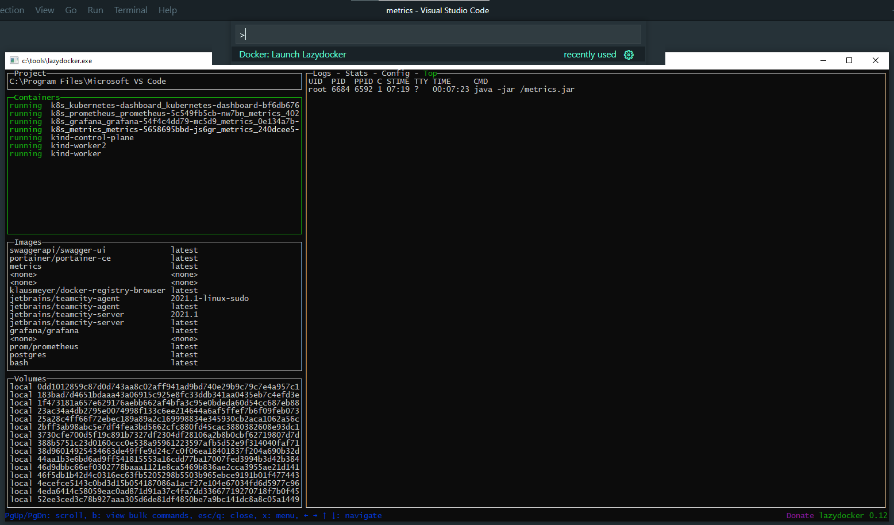

# docker-lazydocker README

A VSCode extension to run `lazydocker` command. The `lazydocker` command is asimple terminal UI for both docker and docker-compose. See [lazydocker](https://github.com/jesseduffield/lazydocker) for details.

## Features

Uses the `lazydocker` command from the path specified in settings. Default value is `lazydocker`, in which case the `lazydocker` commands is expected to be available on the PATH.

## Known Issues

No known issues.

## Release Notes

### 1.0.0

Initial release
